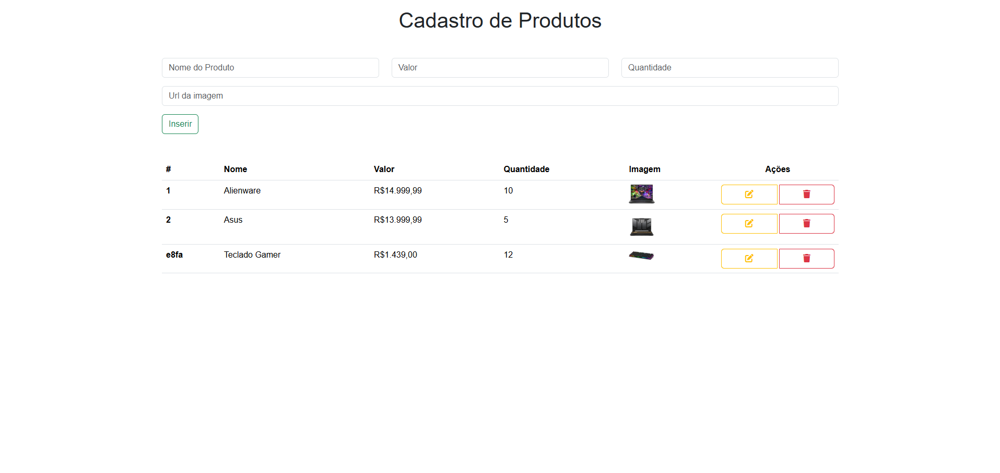

### Treinamento React com Bootstrap, Json, Axios

* React
    useState()
    useEffect()

* Font Awesome
    Icons

* Bootstrap
    Classes que ja vem configuradas
    
* Axios
    Get, Post, Put, Delete

### Screens

